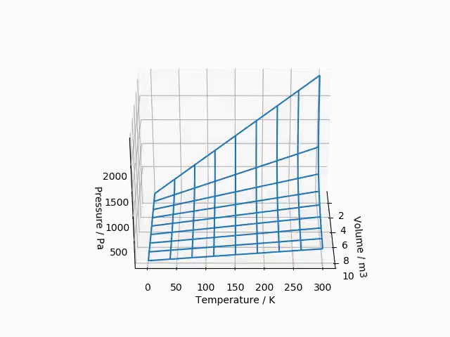

# Ideal gas 3D plot

A simple script to plot pressure *vs* temperature *vs* volume for an ideal gas.



You can run a sample via command line from the project folder after cloning this repo:

```bash
python ideal_gases.py
```

An animation like the one in this readme will be generated.

See the [tutorial file](tutorial.ipynb) for more usage examples.